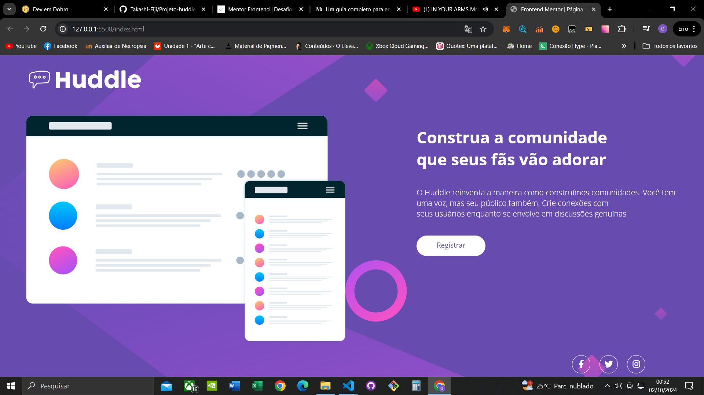
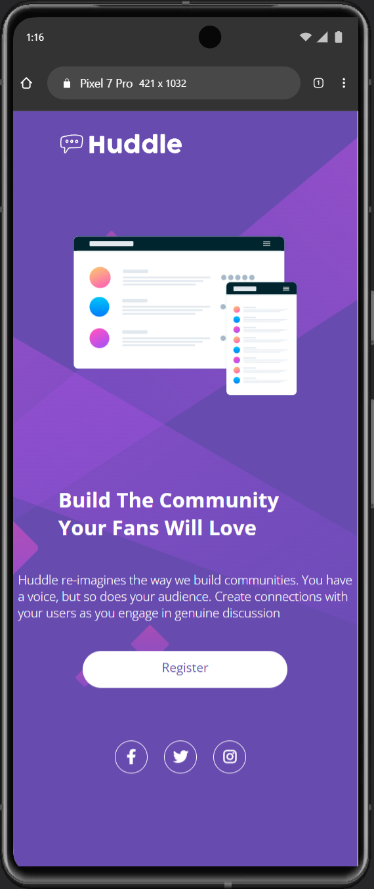

# Frontend Mentor - Huddle Base

Aquri apresento uma Solução para o Desafio:
[Huddle landing page with a single introductory section](https://www.frontendmentor.io/challenges/huddle-landing-page-with-a-single-introductory-section-B_2Wvxgi0/hub)

## Tabela de Conteúdos
- [Visão Geral](#visão-geral)
- [O Desafio](#o-desafio)
- [Prints](#prints)
- [Meu Processo](#meu-processo)
- [Construído com](#construído-com)
- [O que aprendi](#o-que-aprendi)
- [Autor](#autor)
- [Agradecimentos](#agradecimentos)

## Visão Geral

### O Desafio
Página de Destino Huddle com uma única seção Introdutória 

- Elementos Interativos
- Responsividade para diferentes tipos de acesso

# Screenshots
## Resultado Final

## Elementos Interativos

## Responsivo

## Meu processo
Foi meu Primeiro Projeto Solo, senti medo a todo instante porém sabia que era possível.
Logo que comecei as coisa começaram a se encaixar melhor conforme eu desenvolvia o projeto.
Primeiro sempre devemos estabelecer uma ideia clara do que queremos reproduzir de como o projeto deve ficar e como será utilizado cada elemento seja ele "MAIN","DIV" ou "CLASS".

E como todo bom Desafio tem a etapa do Medo e Insegurança,
senti dificuldade nas partes do Footer e Reponsividade 
alguns Elementos podem se quebrar caso rodem em Dispositivos Mobile menores que o do Screenshot (Texto "H2" e "P") ("Footer" com "padding" para centralização) não consegui aplicar um bom responsivo á eles e isso me incomoda um pouco mas sei q a jornada está apenas no começo e meus estudos devem continuar, fora esses pequenos erros de responsividade sinto-me feliz com o código.

sintam-se á vontade para mexerem no projeto! 

## Construido com:
- [HTML]
- [CSS]

## O que eu Aprendi
Aprendi que estabelecer a "WIDTH" com "%" é melhor BEM MELHOR kkk
e que eu preciso me atentar mais a SEMÂNTICA do code para que eu não tenha dores de cabeça ao realizar uma manutenção ou mudança no Site/Página.

(sigo animado sem deixar que os pequenos erros interfiram na realização do primeiro código solo... )

## Autor

- linkedin - [Gabriel-Souza/Takashi-Eiji](https://www.linkedin.com/in/gabriel-souza-b70074262/)
- Frontend Mentor - [@Takashi-Eiji](https://www.frontendmentor.io/profile/Takashi-Eiji)
- Instagram - [@biel_h_souza](https://www.instagram.com/biel_h_souza/)

## Agradecimentos 

Agradeço por mais um Desafio! (to ficando bom nisso uashuashua)

- Meus mais Sinceros agradecimentos ao pessoal [Dev-Quest/DevemDobro]
- Meus mais Sinceros agradecimentos ao pessoal [FRONTENDMENTOR]

OBS: Takashi-Eiji / Biel